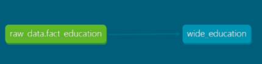
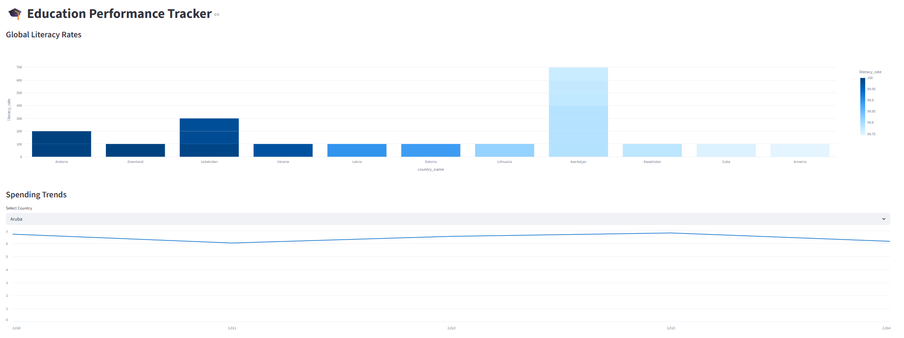

# Global Education Performance Tracker 🎓

## 📝 Problem Statement
Policymakers and global development organizations often struggle to answer a fundamental question: **"Are financial investments in education actually translating into higher literacy outcomes?"**

While the World Bank provides vast datasets, the "long-format" structure makes it difficult to perform year-over-year comparative analysis across different nations without significant manual restructuring. **This is a critical barrier to evidence-based policy.** Without a centralized, transformed view, it is nearly impossible to identify which fiscal strategies are working.

This project builds a cloud-native ELT pipeline to automate the extraction and transformation of these indicators. By creating a unified "wide" dataset, we allow stakeholders to visualize the direct correlation between government expenditure and literacy rates. This transition from raw, siloed data to an interactive analytical tool enables NGOs and governments to identify successful funding models and reallocate resources where they are most needed to improve global education standards.

## 🏗️ Architecture
The project follows a modern Data Engineering lifecycle:
* **Infrastructure:** Terraform (IaC) to manage Google Cloud Storage and BigQuery.
* **Ingestion:** Python (Batch) extracting World Bank data to Parquet files and uploading to GCS.
* **Data Warehouse:** Google BigQuery, utilizing **Partitioning** (by Year) and **Clustering** (by Country Code).
* **Transformation:** **dbt** to pivot raw indicators into an analytical-ready "wide" format.

* **Orchestration:** Scripted workflow utilizing the `uv` package manager.
* **Visualization:** Streamlit dashboard with interactive Plotly components.


---

## 🚀 Getting Started

### 1. Prerequisites
* Python 3.12+ (using `uv` for package management)
* Google Cloud Platform account and a project ID.
* Terraform installed.

### 2. Infrastructure Setup
```bash
cd terraform
terraform init
terraform apply
```

### 3. Data Ingestion
```bash
# Install dependencies
uv sync

# Run ingestion script
uv run ingest_data.py
```

### 4. Transformations (dbt)
```bash
cd dbt_edu
# Copy the example profile to your local dbt config
mkdir -p ~/.dbt
cp profiles.yml.example ~/.dbt/profiles.yml 
# (Note: Edit ~/.dbt/profiles.yml to add your Project ID)

uv run dbt deps
uv run dbt run
```

Note: Ensure your ```~/.dbt/profiles.yml``` is configured for BigQuery with the ```us-central1 location```.

### 5. Dashboard
```bash
uv run streamlit run app.py
```
## 📊 Data Warehouse Optimization
To maximize query performance and minimize costs:
* **Partitioning:** The `fact_education` table is partitioned by `year`. This allows the Streamlit dashboard to fetch specific time-ranges without scanning the entire dataset.
* **Clustering:** Data is clustered by `country_code`. This ensures that when a user selects a specific country in the dashboard, BigQuery only reads the relevant blocks of data.

## 🛠️ Project Evolution & Uniqueness
While this project follows the core architecture of the Data Engineering Zoomcamp, it features a unique implementation focused on Global Education Economics. The custom dbt logic to pivot disparate World Bank indicators into a synchronized analytical dataset was developed specifically for this use case to bridge the gap between raw data and actionable policy insights.